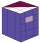

#  tiler


[](https://github.com/the-lay/tiler/actions/workflows/ci.yml)
[](https://github.com/psf/black)
[](https://coveralls.io/github/the-lay/tiler?branch=master)
[](https://badge.fury.io/py/tiler)


[Github repository](https://github.com/the-lay/tiler) | 
[Github issues](https://github.com/the-lay/tiler/issues) | 
[Documentation](https://the-lay.github.io/tiler)
_________________
⚠️ **Please note: work in progress, things will change and/or break!** ⚠️
_________________

This python package provides consistent and user-friendly
functions for tiling/patching and subsequent merging of NumPy arrays.

Such tiling is often required for various heavy image-processing tasks
such as semantic segmentation in deep learning, especially in domains where images do not fit into GPU memory
(e.g., hyperspectral satellite images, whole slide images, videos, tomography data).

Please see [Quick start section](https://github.com/the-lay/tiler#quick-start).   
If you want to use tiler interactively, I highly recommend [napari](https://github.com/napari/napari) and [napari-tiler plugin](https://github.com/tdmorello/napari-tiler).


Features
-------------
 - N-dimensional
 - Optional in-place tiling
 - Optional channel dimension (dimension that is not tiled)
 - Optional tile batching
 - Tile overlapping
 - Access individual tiles with an iterator or a getter
 - Tile merging, with optional window functions/tapering


Quick start
------------ 
You can find more examples in [examples](https://github.com/the-lay/tiler/tree/master/examples).  
For more Tiler and Merger functionality, please check [documentation](https://the-lay.github.io/tiler).

```python
import numpy as np
from tiler import Tiler, Merger

image = np.random.random((3, 1920, 1080))

# Setup tiling parameters
tiler = Tiler(data_shape=image.shape,
              tile_shape=(3, 250, 250),
              channel_dimension=0)

## Access tiles:
# 1. with an iterator
for tile_id, tile in tiler.iterate(image):
   print(f'Tile {tile_id} out of {len(tiler)} tiles.')
# 1b. the iterator can also be accessed through __call__
for tile_id, tile in tiler(image):
   print(f'Tile {tile_id} out of {len(tiler)} tiles.')
# 2. individually
tile_3 = tiler.get_tile(image, 3)
# 3. in batches
tiles_in_batches = [batch for _, batch in tiler(image, batch_size=10)]

# Setup merging parameters
merger = Merger(tiler)

## Merge tiles:
# 1. one by one
for tile_id, tile in tiler(image):
   merger.add(tile_id, some_processing_fn(tile))
# 2. in batches
merger.reset()
for batch_id, batch in tiler(image, batch_size=10):
   merger.add_batch(batch_id, 10, batch)

# Final merging: applies tapering and optional unpadding
final_image = merger.merge(unpad=True)  # (3, 1920, 1080)
```
 
Installation
-------------
The latest release is available through pip:

```bash
pip install tiler
```

Alternatively, you can clone the repository and install it manually:

```bash
git clone git@github.com:the-lay/tiler.git
cd tiler
pip install
```

If you are planning to contribute, please take a look at the [contribution instructions](.github/CONTRIBUTING.md).

 
Motivation & other packages
-------------
I work on semantic segmentation of patched 3D data and
I often found myself reusing tiling functions that I wrote for the previous projects.
No existing libraries listed below fit my use case, so that's why I wrote this library.

However, other libraries/examples might fit you better:
 - [vfdev-5/ImageTilingUtils](https://github.com/vfdev-5/ImageTilingUtils)
    - Minimalistic image reader agnostic 2D tiling tools

 - [BloodAxe/pytorch-toolbelt](https://github.com/BloodAxe/pytorch-toolbelt#inference-on-huge-images)
    - Powerful PyTorch toolset that has 2D image tiling and on-GPU merger

 - [Vooban/Smoothly-Blend-Image-Patches](https://github.com/Vooban/Smoothly-Blend-Image-Patches)
    - Mirroring and D4 rotations data (8-fold) augmentation with squared spline window function for 2D images

 - [samdobson/image_slicer](https://github.com/samdobson/image_slicer)
    - Slicing and merging 2D image into N equally sized tiles

 - [dovahcrow/patchify.py](https://github.com/dovahcrow/patchify.py)
    - Tile and merge 2D, 3D images defined by tile shapes and step between tiles
   
 - Do you know any other similar packages?
    - Please let me know by contacting me, [making a PR]((https://github.com/the-lay/tiler/pulls)) or [opening a new issue](https://github.com/the-lay/tiler/issues).

Moreover, some related approaches have been described in the literature:
 - [Introducing Hann windows for reducing edge-effects in patch-based image segmentation](https://doi.org/10.1371/journal.pone.0229839
), Pielawski and Wählby, March 2020


Frequently asked questions
-------------
This section is a work in progress.

**How do I create tiles with less dimensions than the data array?**

Tiler expects `tile_shape` to have less than or the same number of elements as `data_shape`.
If `tile_shape` has less elements than `data_shape`, `tile_shape` will be prepended with 
ones to match the size of `data_shape`.  
For example, if you want to get 2d tiles out from 3d array you can initialize Tiler like this: `Tiler(data_shape=(128,128,128), tile_shape=(128, 128))` and it will be equivalent to
`Tiler(data_shape=(128,128,128), tile_shape=(1, 128, 128))`.
